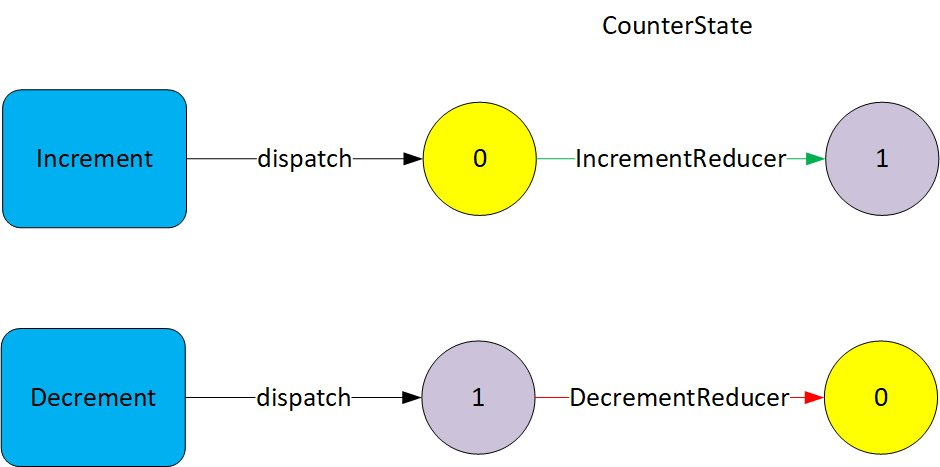
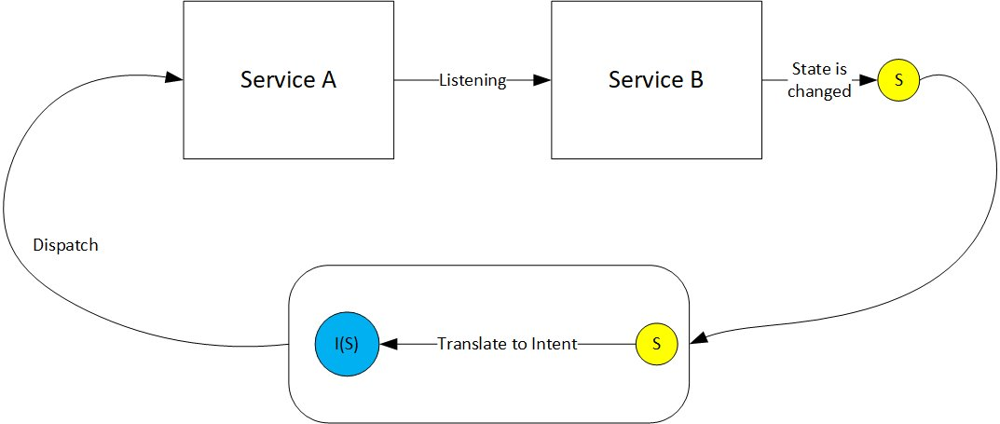

# Redis framework

Redis is a predictable state container for Android applications.
It helps you write applications that behave consistently and are easy to test.

The library is inspired by redux.js.org

The basic idea behind Redis is a service actor that has a well-defined state. In order for the service to change its state, it is necessary to send an intent to the service to perform some action, as a result of which the service will go into the desired state.

A service can asynchronously accept any number of intents, but the service executes each intent sequentially, i.e. the service behaves like an Actor.

In order for a service to change its state, a reducer is needed. A reducer is a kind of pure function that receives the current state and intent as input, and outputs a new state at the output.
```kotlin
(currentState, Intent) -> newState
```
The whole idea is reflected in the following diagram:


## Sample

Let's create a simple service with a counter as its state. You can send two intentions to the service to increase or decrease the counter by one.



```kotlin

//Service state with payload
data class CounterState(val counter : Int) : State() {
    override fun clone(): State {
        return CounterState(counter)
    }
}

//Intents
class Increment : IntentMessage()

class Decrement : IntentMessage()

//Reducers
class IncrementReducer : DefaultReducer(null, Increment::class) {
    override fun reduce(
        currentState: State,
        intent: IntentMessage
    ): kotlinx.coroutines.flow.Flow<State>? {
        return flow {
            val newState = CounterState(currentState.cast<CounterState>()!!.counter + 1)
            emit(newState)
        }
    }
}

class DecrementReducer : DefaultReducer(null, Decrement::class) {
    override fun reduce(
        currentState: State,
        intent: IntentMessage
    ): kotlinx.coroutines.flow.Flow<State>? {
        return flow {
            val newState = CounterState(currentState.cast<CounterState>()!!.counter - 1)
            emit(newState)
        }
    }
}

//Using
private val counterService = RedisCoroutineStateServiceBuilder(
        lifecycleScope,
        listOf(IncrementReducer(), DecrementReducer())
    )
        .setInitialState(CounterState(0))
        .build()
        
counterService.subscribe(object : ServiceSubscriber {
            override suspend fun onReceive(newState: State) {
                logger.info("counterService state = $newState")
            }
})

counterService.dispatch(Increment())
```      

## Triggers

When a service transitions from one state to another, a trigger can be fired. A trigger allows you to perform some action or send an intent to your own service.

Triggers, like reducers, can be specific or generic. A specific trigger will fire only for a given transition from one state to another.


## Listening to other services

The service can listen to any number of other services. When the listened service changes its state, the listener service receives a certain message intent, which says that some service has entered a new state indicating this state. Thus, a service can react to a change in the state of other services and perform some action in response to this change.



## Saving and restoring state

You can use an arbitrary key-value store to save and restore service state. This is especially useful in the android environment, where the operating system ends the process and then restarts it when the user returns to the application.

## Redis android. ViewModel + RedisStateService = MVI  (Unidirectional Data Flow)


Based on the Redis service, we made a simple ViewModel for the MVI pattern. To change the state of the ViewModel, an intent must be dispatched. And at the output, the ViewModel has two LiveData: viewStateLive and viewEventLive. ViewStateLive is used for constant rendering of the UI. In fact, it is a screen model. And viewEventLive is used for all sorts of events that need to be processed only once. For example, SnackBar, Toast, Dialog.

## License
  [MIT](LICENSE)
